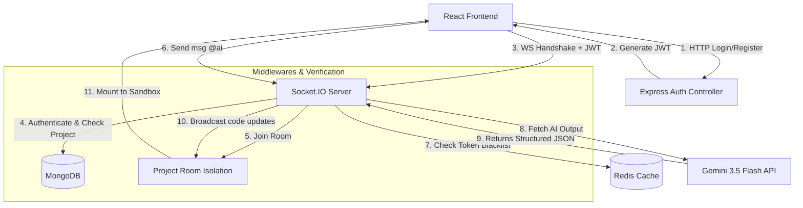

# 🧠 Collaborative AI-Agent Chat & IDE Workspace

[](https://expressjs.com/)
[](https://react.dev/)
[](https://socket.io/)
[](https://redis.io/)
[](https://www.mongodb.com/)
[](https://ai.google.dev/)

A production-ready full-stack orchestrator for a multi-user collaborative workspace and cloud-based IDE. It integrates **Socket.IO** for real-time synchronization, **Redis** for stateful token blacklisting, **MongoDB** for workspace storage, and **Google Gemini 3.5 Flash** for in-context AI-agent assistance. 

The frontend leverages **WebContainers (`@webcontainer/api`)** to run and execute full node environments directly inside the browser sandbox, synchronized in real-time with collaborators.

---

## 🚀 Key Engineering & Architecture Achievements

* **Isolated Collaboration Workspaces:** Engineered a room-based websocket architecture using Node.js, Express, and Socket.IO, isolating multi-user workspaces into dedicated channels with zero cross-room socket pollution.
* **Dual-Layer Session Security:** Designed a security scheme combining stateless JWT validation with high-performance **Redis/Valkey cache** token invalidation, achieving O(1) instantaneous session revocation on user logout.
* **Structured AI Code-Generation:** Integrated Google Gemini 3.5 Flash API using `@google/genai`, enforcing strict JSON schema constraints for structured code-generation outputs that automatically map into virtual sandbox environments.
* **Optimal Relationship Modeling:** Optimized database schema design with Mongoose/MongoDB, building relationship maps for project collaborators and utilizing query indexes to facilitate sub-second collaborator search and indexing.
* **In-Browser Code Execution:** Built a real-time collaborative development platform integrating a React 19 frontend with an Express and Socket.IO backend to synchronize workspaces, file trees, and chat logs across active users.
* **Client-Side Virtual Sandboxing:** Integrated **WebContainer API**, enabling developers to boot local node environments, install dependencies, and run full-stack servers directly in the browser sandbox.

---

## 🗺️ System Architecture & Workflow

The diagram below details the end-to-end flow of requests, websocket connections, and the integration of Redis and Gemini AI services:



---

## 🛠️ API Endpoint Specifications

### 👤 User Endpoints (`/user`)

| Method | Endpoint | Auth Required | Description |
| :--- | :--- | :---: | :--- |
| `POST` | `/user/register` | No | Creates a new user with bcrypt-hashed credentials. Returns JWT. |
| `POST` | `/user/login` | No | Authenticates login input. Returns token. |
| `GET` | `/user/profile` | Yes | Retrieves the profile payload of the current user. |
| `GET` | `/user/logout` | Yes | Blacklists the active JWT token in Redis for 24 hours. |
| `GET` | `/user/get-all` | Yes | Retrieves list of all registered users (excluding current user). |

### 📁 Project Endpoints (`/projects`)

| Method | Endpoint | Auth Required | Description |
| :--- | :--- | :---: | :--- |
| `POST` | `/projects/create` | Yes | Initializes a new workspace project. |
| `GET` | `/projects/all` | Yes | Fetches all projects where the user is listed as a collaborator. |
| `PUT` | `/projects/add-user` | Yes | Adds new users to a project's collaborator roster. |
| `GET` | `/projects/get-project/:projectId` | Yes | Returns details of a specific project, including its user details. |

---

## 💡 Deep-Dive: Architectural & Engineering Decisions

### 1. Cross-Project Socket Room Isolation
When a user connects, we extract the `projectId` from the handshake query and check if it matches a project they are authorized to collaborate on in the database. If authorized, they are joined into a specific socket room named after the Project's MongoDB ID: `socket.roomId = socket.project._id.toString()`. All events are broadcasted strictly using `socket.broadcast.to(socket.roomId).emit(...)`, shielding other rooms.

### 2. Structured JSON Output Constraints
We configure the request options inside `ai.models.generateContent` with: `responseMimeType: "application/json"`. Simultaneously, the system prompt contains strict JSON schema guidelines. By utilizing the native JSON output mode of Gemini, the api returns a machine-readable JSON structure, eliminating regex-based parsing hacks and failures on the client.

### 3. Stateless JWT Invalidation via Redis
Since JWTs are stateless, they remain valid until expired. If a token is compromised, simple client-side deletion isn't enough. We solve this by adding the token to a Redis cache upon user logout. The Redis key is configured with a Time-To-Live (TTL) equal to the token's remaining validity duration. The `authUser` middleware intercepts every request and runs `redis.get(token)`—if found, it immediately blocks access, invalidating the session.

### 4. Cross-Platform Configuration Adaptability
We configured client initializations and server bindings to adapt dynamically to deployment environments:
1. **Dynamic Model Overrides**: The backend defaults to `gemini-3.5-flash` but checks `process.env.GEMINI_MODEL`, allowing model upgrades directly via environmental controls.
2. **Robust Port & Database bindings**: Checks `process.env.PORT` and `process.env.MONGODB_URI` fallback endpoints, enabling easy hosting.
3. **Unified API Fallbacks**: The Gemini client loads the API key by prioritizing `GEMINI_API_KEY`, followed by `GOOGLE_AI_KEY` and `GEMINI_KEY`.

---

## 🔧 Getting Started & Deployment

### Local Development Setup

1. **Install dependencies**
   ```bash
   npm install
   ```

2. **Configure environment variables**
   Create a `.env` file in the root backend folder:
   ```env
   PORT=4000
   MONGODB_URI=mongodb://localhost:27017/chatappwithai
   JWT_SECRET=your_super_secret_jwt_key
   REDIS_URI=redis://127.0.0.1:6379
   GEMINI_API_KEY=your_gemini_api_key
   ```

3. **Start the Express server**
   ```bash
   npm run dev
   ```

### Render Deployment Steps
1. Push your changes to GitHub.
2. Create a new **Web Service** on Render.
3. Select your repository.
4. Set the **Start Command** to `node server.js`.
5. Under environment variables, configure `PORT`, `MONGODB_URI` (MongoDB Atlas link), `REDIS_URI` (Render Redis or RedisLabs), `JWT_SECRET`, and `GEMINI_API_KEY`.

---

## 🔒 License
This project is open-source and available under the [MIT License](LICENSE).
